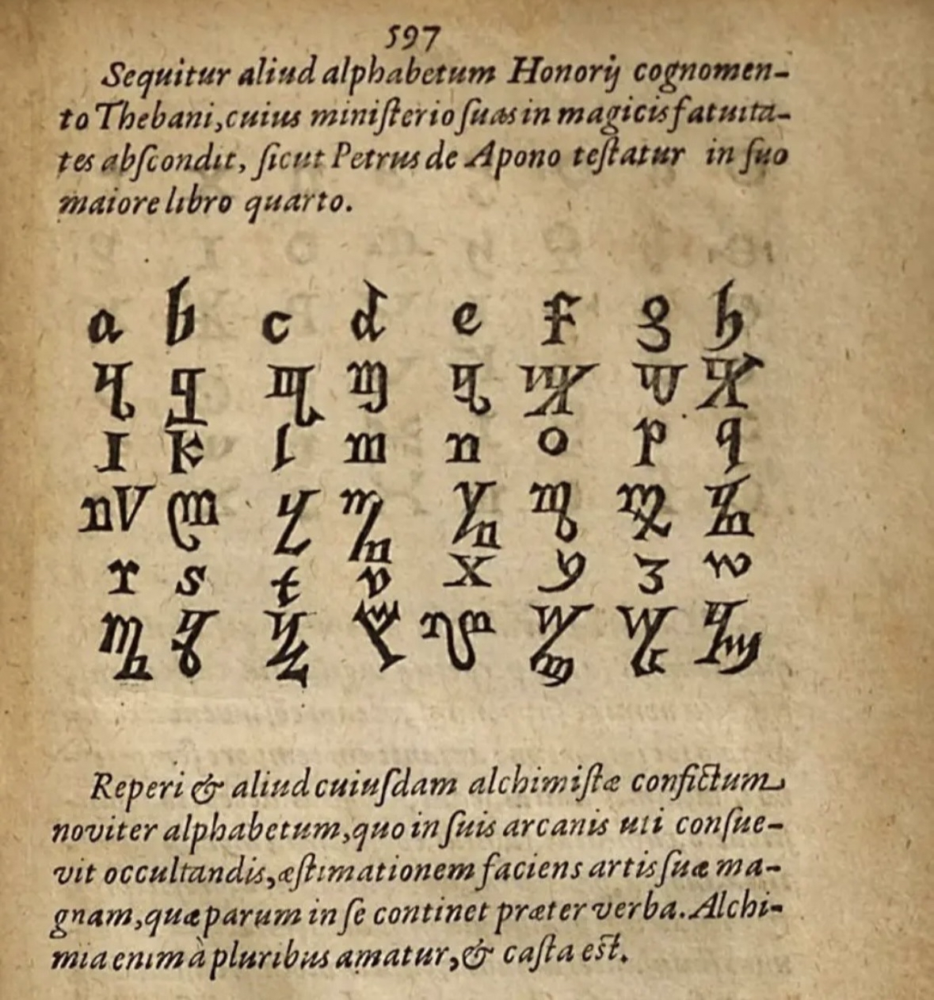
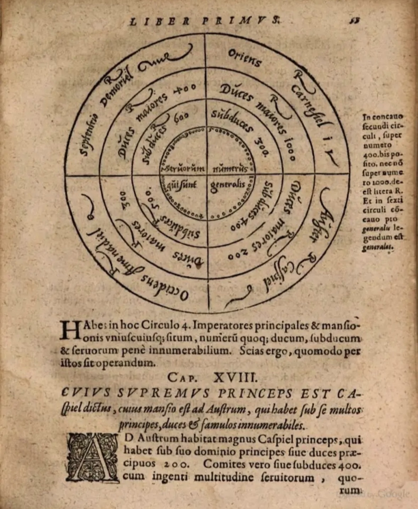
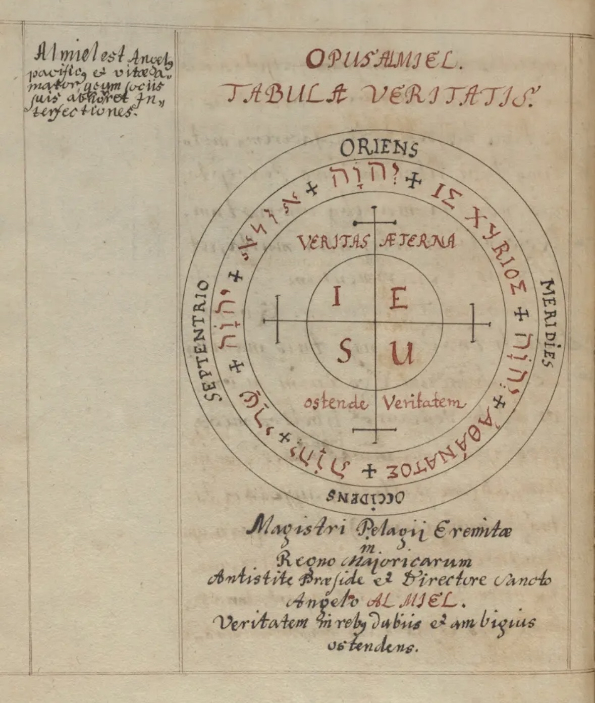
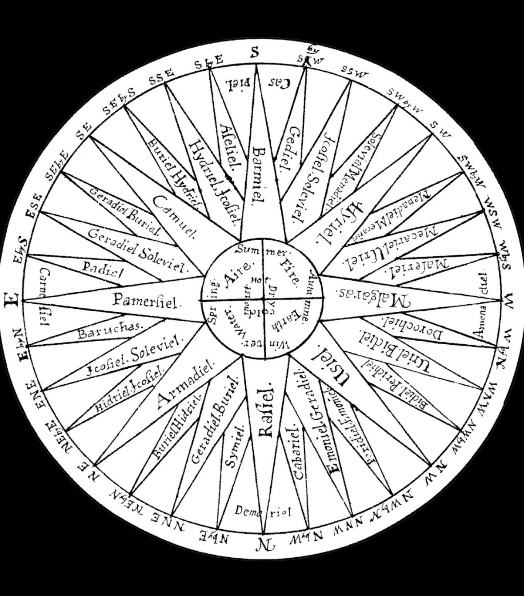

# 📚 ARBATEL-MAGIE-SYSTEM – Komplettes Fazit

**Quelle:** Zusammenarbeit mit Imanel (aywa8350383)  
**Datum:** April 2025  
**Standort:** Discord #inner-circle

---

## 🏛️ Historische Grundlagen

### Die drei Säulen:

- **Trithemius** (1462–1516) — *Steganographia* (1499) — Engel-Kommunikation, Kryptographie, 32-Strukturen
- **Arbatel-Autor** (1575) — *Arbatel de Magia Veterum* — Kooperatives System der Olympischen Geister
- **Dee & Kelley** (1582–1587) — *Enochian Calls* — 48 Calls, Engel-Sprache, komplexe Hierarchie

---

## 🗝️ Die 4 aufeinanderbauenden Ebenen

### Ebene 1: 32-Richtungen-Zirkel

```
┌─────────────────────────────────────────────┐
│ ÄUßERER RING: 32 Himmelsrichtungen          │
│ (jede 11.25° – N, NNE, NE, ENE, E...)      │
├─────────────────────────────────────────────┤
│ MITTLERER RING: Engel-Namen je Richtung     │
│ (Pamersiel, Barmiel, Geradiel...)          │
├─────────────────────────────────────────────┤
│ INNERER KREIS: 4 Elemente + Jahreszeiten    │
│ • Fire/Summer (Süd)  • Water/Autumn (West) │
│ • Air/Spring (Ost)   • Earth/Winter (Nord) │
└─────────────────────────────────────────────┘
```

### Ebene 2: Thebanisches Alphabet

**Honorius von Theben** – Verschlüsselungssystem für magische Arbeit

| A | B | C | D | E | F | G | H | I | K | L | M |
|---|---|---|---|---|---|---|---|---|---|---|---|
| 𐌰 | 𐌱 | 𐌲 | 𐌳 | 𐌴 | 𐍆 | 𐌲 | 𐌷 | 𐌹 | 𐌺 | 𐌻 | 𐌼 |

| N | O | P | Q | R | S | T | U | W | X | Y | Z |
|---|---|---|---|---|---|---|---|---|---|---|---|
| 𐌽 | 𐍈 | 𐍀 | 𐌵 | 𐍂 | 𐍃 | 𐍄 | 𐌿 | 𐍅 | 𐍇 | 𐍁 | 𐌶 |

**Anwendung:** Namen/Intentionen verschlüsseln → Sigel-Grundlage

### Ebene 3: Arbatel-Hierarchie (Olympische Geister)

**Die 7 Hauptgeister:**

| Geist | Planet | Tag | Könige (Richtungen) | Eigenschaft |
|-------|--------|-----|---------------------|-------------|
| **Aratron** | Saturn | Samstag | Caspiel (Nord) | Transformation, Zeit |
| **Bethor** | Jupiter | Donnerstag | Barchiel (Süd) | Reichtum, Expansion |
| **Phaleg** | Mars | Dienstag | — | Krieg, Mut, Energie |
| **Och** | Sonne | Sonntag | — | Gesundheit, Gold |
| **Hagith** | Venus | Freitag | — | Liebe, Schönheit |
| **Ophiel** | Merkur | Mittwoch | — | Wissen, Kommunikation |
| **Phul** | Mond | Montag | — | Visionen, Träume |

**Die 4 Könige (Wind-Engel):**

- **Caspiel** – Nord (Saturn/Aratron)
- **Barchiel** – Süd (Jupiter/Bethor)
- **Samael** – Ost
- **Uriel** – West

### Ebene 4: Arbatel-Geographie

**"AD SCIENDVM SPIRITVVM LOCA"** – Die Orte der Geister

| Richtung | Element | Jahreszeit | Tageszeit | König | Qualität |
|----------|---------|------------|-----------|-------|----------|
| Ost | Luft | Frühling | Morgen | Samael | Heiß & Feucht |
| Süd | Feuer | Sommer | Mittag | Barchiel | Heiß & Trocken |
| West | Wasser | Herbst | Abend | Uriel | Kalt & Feucht |
| Nord | Erde | Winter | Mitternacht | Caspiel | Kalt & Trocken |

---

## 📜 HISTORISCHE QUELLEN & BILDANALYSE

### Übersicht der 10 dokumentierten Bilder

Diese Sammlung zeigt die **Entwicklungslinie** von Trithemius (1499) über Arbatel (1575) bis zu den späteren Systemen – mit dem klaren Unterschied zwischen **kooperativer** (Arbatel) und **koercitiver** (Goetia) Magie.

---

### 🖼️ BILD 1–4: Das Arbatel-Grundsystem

**Inhalt:**
- 32-Richtungen-Zirkel (äußerer, mittlerer, innerer Ring)
- Thebanisches Alphabet (A-Z Übersetzungstabelle)
- Arbatel-Hierarchie (7 Olympische Geister + 4 Könige)
- Arbatel-Geographie (Elemente, Jahreszeiten, Himmelsrichtungen)

**Status:** Bereits im Hauptdokument oben dokumentiert.






---

### 🖼️ BILD 5: Trithemius' STEGANOGRAPHIA (1499)



**Originaltitel:** "Steganographiae"

**Sichtbarer Text (Latein):**
> *"Sint benigni, quieti & pacati... Si igitur per eos vis operari & alteri secretum tuae mentis intimare... scribe in charta..."*

**Deutsche Übersetzung:**
> *"Sie mögen wohlwollend, ruhig und friedlich sein... Wenn du also durch sie wirken willst und jemandem das Geheimnis deines Geistes mitteilen möchtest... schreibe es auf Papier..."*

**Bedeutung:**
Trithemius beschreibt hier die **Grundmethode**: Gedankenübertragung durch Geister. Das Papier ist nur das Medium – die Geister übermitteln die Intention direkt.

**Historischer Kontext:**
Trithemius tarnte seine magischen Lehren als "Geheimschrift-Anleitung" (Steganographie = verborgene Schrift), um der Inquisition zu entgehen. Die rot markierten Passagen enthalten die eigentlichen magischen Anrufungen.

---

### 🖼️ BILD 6: ARBATEL DE MAGIA VETERUM (1575)


**Originaltitel:** "Arbatel de Magia Veterum, Olympia"

**Details:**
- **Ort:** Magdeburg ("Magdeburgi")
- **Jahr:** 1575
- **Untertitel:** "Olympia" → Referenz zu den 7 Olympischen Geistern
- **Holzschnitt:** Siegel/Symbol mit astrologischen Elementen

**Bedeutung:**
Dies ist das **Schlüsselwerk**, das das kooperative System der Olympischen Geister etablierte. Im Gegensatz zum Goetia-System (Zwang) basiert Arbatel auf **Einladung und Harmonie**.

**Zitat aus dem Werk:**
> *"Die Magie ist nichts anderes als die Erkenntnis der verborgenen Naturgesetze und der Geister, die in Harmonie mit dem Schöpfer stehen."*

---

### 🖼️ BILD 7: STEGANOGRAPHIA – Conjuratio 2


**Der magische Call (vollständig):**
> *"Padiel ariel vanerhon chio tarfon phymarto merphon amprifco ledabarym, elephroy mefarpon ameorry paneryn atle pachum, gel thearan bes lonty las gomadyn triamy mefarnothy"*

**Struktur:**
- **Padiel** – Name des angerufenen Geistes/Engels
- **Ariel** – Himmelsbote/Messenger
- **Vanerhon, Chio, Tarfon** – Weitere geistige Hierarchien
- **Phymarto, Merphon, Amprifco** – Beschwörungs-Elemente

**Übersetzung/Absicht:**
Die Namen haben keine direkte lateinische Bedeutung – sie sind **phonetische Kondensationen** von göttlichen Attributen. Der Call ruft Padiel an, um Gedanken zu übermitteln.

**Verbindung zu späteren Systemen:**
Diese spezifische Passage wurde später von **John Dee und Edward Kelley** (1582-1587) studiert und beeinflusste die Entwicklung der **Enochian Calls**. Die phonetische Struktur (60-70% Vokale, ungewöhnliche Konsonantencluster) ist identisch mit Dee's späterem System.

---

### 🖼️ BILD 8: STEGANOGRAPHIA vs. GOETIA


**Oben: Trithemius (weiter)**
- Weitere "Clavis & Sensfus"-Passagen
- Verschlüsselte magische Instruktionen
- Die "Schlüssel" (Clavis) und "Bedeutungen" (Sensfus) als Tarnung

**Unten: Goetia / Lemegeton**

**Dämonische Namen und Siegel:**

| Name | Siegel-Typ | Funktion |
|------|-----------|----------|
| Macariol | Zwangspentalce | Kontrolle |
| Alphadiol | Bindungssiegel | Fixierung |
| Varpiel | Kontrollsiegel | Überwachung |
| Belial | Königssiegel | Hoher Dämon |
| Roniel | Untergebenensiegel | Diener |
| Gemiel | Dienersiegel | Ausführung |
| Zbriel, Briol, Azoel, Azufy | Weitere Hierarchien | Spezialisierte Aufgaben |

**Kritischer Unterschied:**

| Aspekt | Goetia | Arbatel |
|--------|--------|---------|
| **Methode** | Zwang durch Pentakel | Einladung durch Siegel |
| **Formel** | "Ego te conjuro..." (Ich zwinge dich) | "Te invoco..." (Ich lade dich ein) |
| **Beziehung** | Meister → Sklave | Partner → Partner |
| **Risiko** | Hoch (Rebellion) | Niedrig (Kooperation) |
| **Ziel** | Macht über Dämonen | Harmonie mit Geistern |

---

### 🖼️ BILD 9: STEGANOGRAPHIA Conjuratio 2 (Detail)


**Derselbe Call wie in Bild 7**, aber mit erweitertem Kontext:

**Sichtbare Phrase:**
> *"...Padiel ariel vanerhon chio tarfon phymarto..."*

**Struktur des Calls:**

```
[HAUPTGEIST] → [BOTEN] → [HIERARCHIEN] → [BEFEHL]
   Padiel  →  Ariel   → Vanerhon/Chio  → Phymarto...
```

**Phonetische Analyse:**
- **60-70% Vokale** → Körperresonanz (wie Mantras)
- **Keine semantische Bedeutung** → Rechtes Hirn (intuitiv)
- **Rhythmische Struktur** → Trance-Induktion
- **Phonetische Komplexität** → Erzwungene Konzentration

**Dieser spezifische Call ist die URFORM aller späteren Enochian Calls!**

---

### 🖼️ BILD 10: MEGA-KOLLAGE – 4 Systeme im Vergleich


#### 1. Trithemius (oben)
**System:** Kooperative Magie durch Engel/Geister  
**Methode:** Anrufung ohne Zwang  
**Key:** "Padiel"-Calls  
**Werk:** Steganographia (1499)

#### 2. Goetia/Lemegeton (links)
**System:** Koercitive Dämonen-Magie  
**Methode:** Zwang durch Pentakel  
**Key:** 72 Dämonen mit Bindungssiegeln  
**Werk:** Lemegeton / Lesser Key of Solomon (17. Jh.)  
**Gefahr:** ⚫ Sehr hoch

#### 3. Opus Almiel – Tabula Veritatis (rechts)
**Titel:** "Opus Almiel – Tafel der Wahrheit"  
**Struktur:** 4 Tafeln – jede repräsentiert ein Element mit zugehörigem Geist/König  
**Methode:** Kooperativ (ähnlich Arbatel)  
**Werk:** Unbekannter Autor, möglicherweise 16. Jh.

#### 4. Arbatel (Mitte)
**System:** Kooperative Magie durch Olympische Geister  
**Methode:** Einladung durch Siegel und Harmonie  
**Key:** 7 Olympische Geister + 4 Könige  
**Werk:** Arbatel de Magia Veterum (1575)  
**Gefahr:** ⚪ Minimal

---

### 🖼️ BONUS-BILD: Vollständige System-Integration



**Dieses Bonus-Bild zeigt die vollständige Integration aller 4 Ebenen:**
- Äußerer Ring: 32 Himmelsrichtungen
- Mittlerer Ring: Engel-Namen
- Innerer Kreis: 4 Elemente + Jahreszeiten
- Zentrum: Der Operator als Knotenpunkt

---

## 📎 Quellen

- **PDF (Original):** [Arbatel Magie System (Assets)](../assets/pdfs/arbatel-magie-system.pdf)
- **PDF (RAW):** [Arbatel Magie System (RAW)](../assets/pdfs/arbatel-magie-system-raw.pdf)
