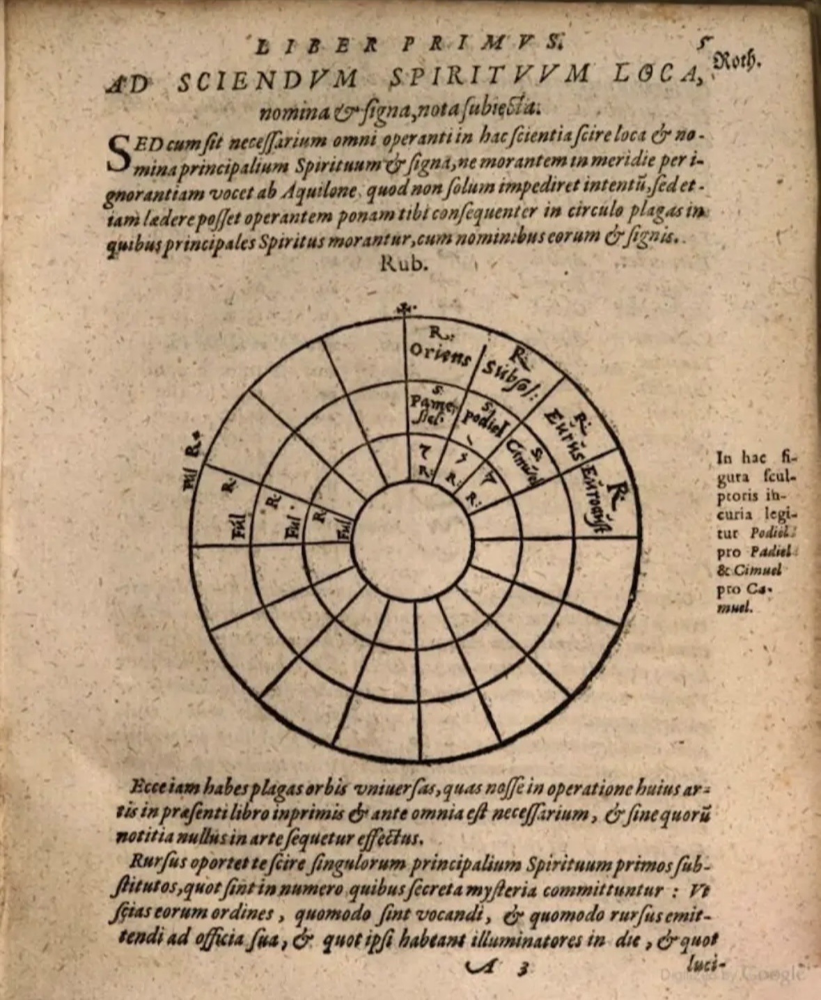
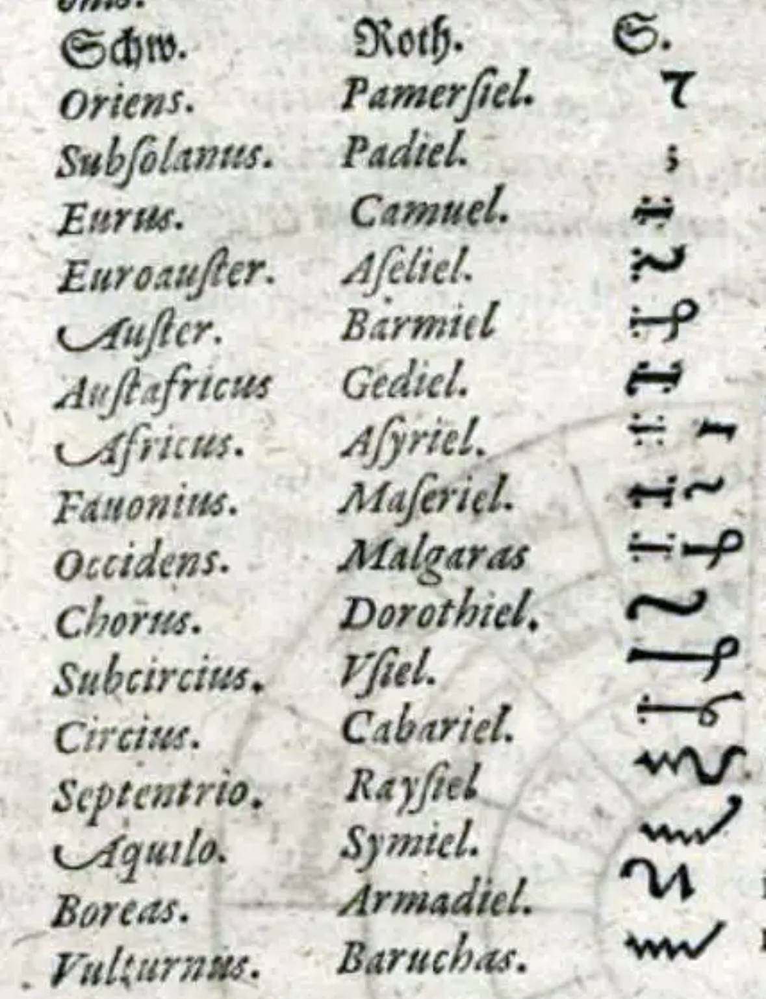

# 🧙 Arbatel Magie System

Das **Arbatel de Magia Veterum** ist eines der einflussreichsten Grimoires der westlichen Esoterik. Geschrieben in der Renaissance, vereint es christliche Mystik, hermetische Philosophie und praktische Magie.

---

## 📖 Dokumente

- **[Vollständige Analyse (Markdown)](arbatel-doku.md)** — Detaillierte Dokumentation des Systems
- **[Original PDF herunterladen](../../assets/pdfs/arbatel-magie-system.pdf)**
- **[Arbatel Raw PDF](../../assets/pdfs/arbatel-raw.pdf)**

---

## 🎨 Bildmaterial

---

*"Die sieben Olympischen Geister wachen über das Wissen der Welt."* 🌟
