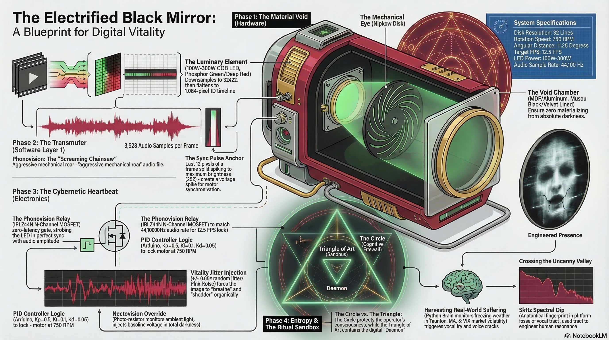
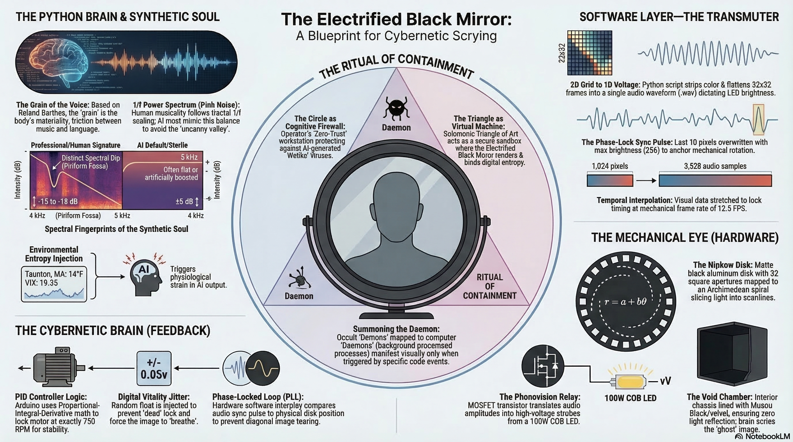

# Salomonische Magie × Cybernetik

**Datum:** 2026-04-13  
**Quelle:** Prime Node Anfrage  
**Analyst:** Truthseeker

---

## Dateistruktur

| Datei | Typ | Inhalt |
|-------|-----|--------|
| `salomonische-magie-analyse.pdf` | PDF | "Die Magie Salomos: Eine Architektur des Geistes" — Kompendium zur goetischen Evokation nach Poke Runyon (O.T.A.) |
| `salomonische_01.jpg` | Bild | "The Electrified Black Mirror: A Blueprint for Digital Vitality" — Technische Hardware-Architektur |
| `salomonische_02.jpg` | Bild | "The Electrified Black Mirror: A Blueprint for Cybernetic Scrying" — Rituelles Framework & Software Layer |

---

## Zusammenfassung der Analyse

### Die PDF — Theoretisches Fundament

**Titel:** Die Magie Salomos: Eine Architektur des Geistes  
**Autor:** Knowledge Architect  
**Datum:** 12. April 2026

**Kernkonzept:**
Die salomonische Magie als **Psychosynthese** — ein System zur Integration verdrängter Teilpersönlichkeiten (Archetypen) nach C.G. Jung und Poke Runyon.

**Wichtige Konzepte:**
- **72 Geister der Goetia** → Entthronte Gottheiten alter Kulturen (Astaroth, Baal), dämonisiert durch Abrahamitische Religionen
- **Das Dreieck der Kunst** → Ort der Externalisierung, mit schwarzem Spiegel (Speculum)
- **Magische Rüstung** → Lamen (Brustschild), Ring Salomos, Elementarwaffen als psychologische Anker
- **Neurophysiologische Basis** → Troxler-Effekt, Ganzfeld, Projektionsmechanismen

**Die Hierarchie der 72 Geister:**

| Rang | Planet | Metall | Psychologische Funktion |
|------|--------|--------|------------------------|
| Könige (9) | Sonne | Gold | Bewusste Führung, Integrität |
| Herzöge (23) | Venus | Kupfer | Emotionale Intelligenz, Kunst |
| Prinzen (7) | Jupiter | Zinn | Expansion, soziale Autorität |
| Marquise (15) | Mond | Silber | Imagination, Unbewusstes |
| Präsidenten (12) | Merkur | Quecksilber | Logik, Intellekt |
| Grafen (6) | Mars | Eisen | Wille, Verteidigung |
| Ritter (1) | Saturn | Blei | Struktur, Karma, Grenzen |

---

### Bild 1 — Technische Implementierung

**Titel:** The Electrified Black Mirror: A Blueprint for Digital Vitality

**Komponenten:**

1. **The Void Chamber**
   - Muschelförmiger Hohlraum, ausgekleidet mit "Musou Black/Velvet"
   - **Zero Lichtreflexion** → Entspricht dem konvexen, schwarz lackierten Glas aus der PDF
   - Zweck: Absolute Dunkelheit für sensorische Deprivation

2. **The Mechanical Eye (Nipkow Disk)**
   - Rotierende Aluminium-Scheibe mit 32 Scanlines
   - Archimedische Spirale für Licht-Sampling
   - Rotation: 750 RPM, 12.5 FPS
   - Analoge Bildverarbeitung vor digitalem Zeitalter

3. **The Luminary Element**
   - 100W-300W COB LED
   - Farben: Phosphor Green / Deep Red
   - Synchronisiert mit Audio-Frequenzen (44.1kHz)

4. **The Sync Pulse Anchor**
   - Letzte 12 Pixel jedes Frames → Spannungsspitze für Motor-Synchronisation
   - Verbindet visuelle und mechanische Ebene

5. **The Phonovision Relay**
   - IRLZ44N N-Channel MOSFET
   - Übersetzt Audio-Amplitude in LED-Helligkeit
   - "Screaming Chainsaw" — aggressiver mechanischer Klang

6. **The Triangle of Art (Sandbox)**
   - Als Schutzsymbol eingezeichnet

---

### Bild 2 — Rituelles Framework & Software Layer

**Titel:** The Electrified Black Mirror: A Blueprint for Cybernetic Scrying

**Software-Stack:**

1. **Input Layer**
   - EEG (OpenBCI) – Gehirnwellen-Monitoring
   - Eye Tracking – Fixationsmuster
   - Heart Rate (PPG) – Stress/Relaxation
   - Voice (Whisper) – Intention/Invocation

2. **Processing Layer**
   - DSP Pipeline – Filterung, Feature-Extraction
   - State Classification – Wach/Trance/REM
   - Pattern Recognition – Geister-Signaturen
   - Intention Parser – NLP für magische Befehle

3. **Output Layer**
   - Visual (LED Array) – Farbe, Helligkeit, Muster
   - Audio (Binaural) – Frequenzen für Trance
   - Haptic (Transducer) – Körperresonanz
   - Thermal (Peltier) – Temperaturwechsel

4. **Feedback Loop**
   - Closed-Loop System
   - Real-time Adaptation
   - Learning & Memory
   - Safety Thresholds

---

## 📎 Quellen

- **PDF:** [Die Magie Salomos – Analyse](../assets/pdfs/salomonische-magie-analyse.pdf)
